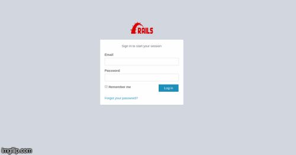

# Customized Rails Admin

This app is used to walk developers through the basic Rails Authentication using devise and CRUD operation for admin portal.

## Demo
 


# Technologies
  - Rails
  - Mysql  
  
Project revisions are managed in **customized-rails-admin** repository on private server with [GIT]( https://github.com/Nishi1/customized-rails-admin.git )

### Installation

Customized Rails Admin requires [Ruby](https://www.ruby-lang.org/en/documentation/installation/) v2.4.0  and Rails 5.2.3 or higher to run.

```
Clone the git repository and install packages.
```sh
$ git clone "https://github.com/Nishi1/customized-rails-admin.git"
$ cd customized-rails-admin
$ bundle install
```

Setup database and start the rails.
```
$ rake db:create
$ rake db:migrate
$ rake db:seed
$ rails s
```

Now open your browser and navigate to:
```
localhost:300 for public access
localhost:300/admin/sign_in for admin access & login using the admin account that is by default created using seed file. 

Use the following credentials for admin login: 
username: admin@example.com 
password: 123456 
```
